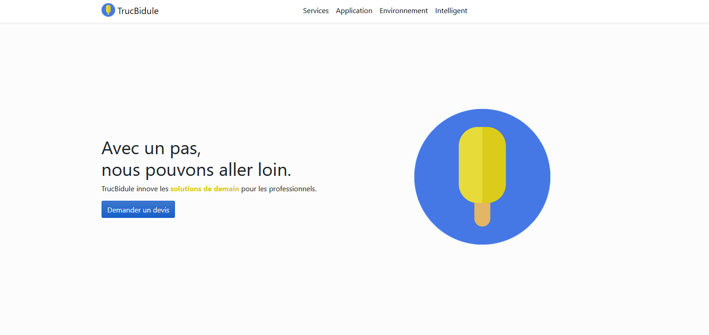
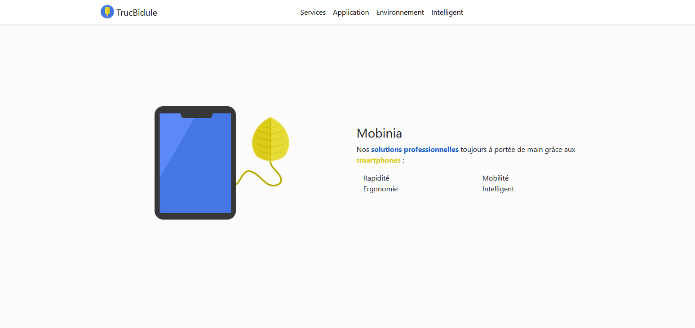
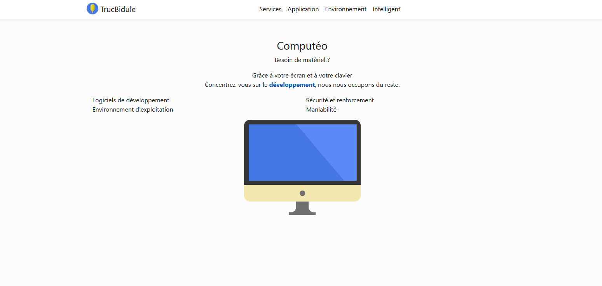
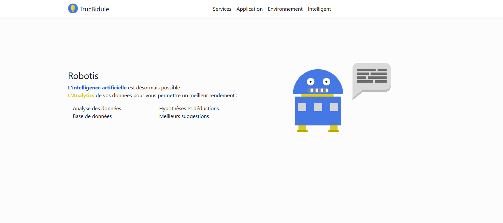
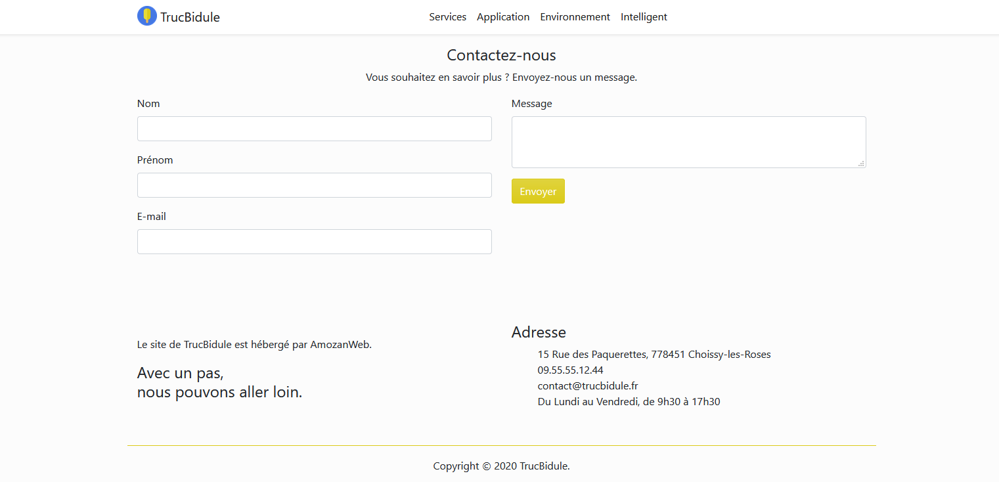

# TrucBidule _(WIP)_

Exemple de projet d'un site vitrine créé avec Vue.js

>**NOTES  :** 
> - L'ensemble des images et des logos ont été créé par moi-même avec le logiciel GIMP 2.0
> - Le site n'est pas encore responsive
>

Quelques screenshots du projet :

